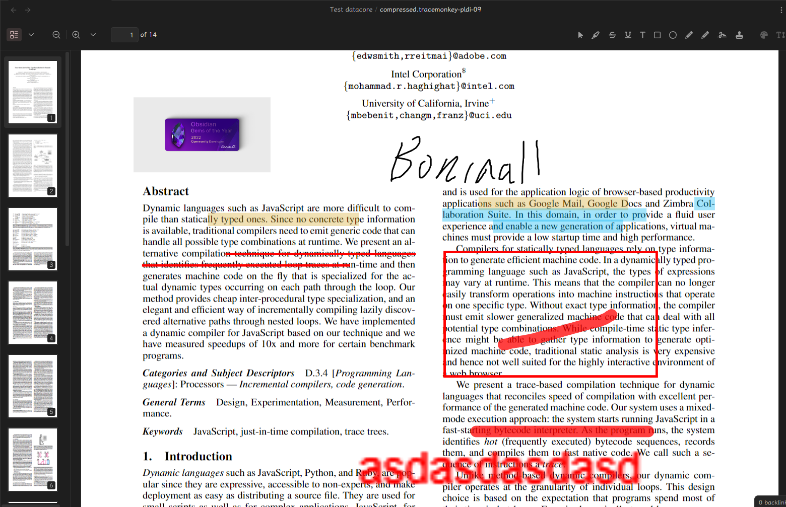

# Obsidian PDF 注释器

[English](./README.md)

简单但功能强大的 Obsidian PDF 注释工具。

**当 Obsidian 合并 pdf.js 4.x 版本时，我将支持将注释保存到 PDF 文件中，或者保存成 Obsidian 所支持的注释。**

## 功能

- 在 Obsidian 中对 PDF 进行注释；
	- 高亮文本；
	- 添加评论；
	- 添加印章；
	- 添加图形；
		- 圆形；
		- 矩形；
	- 添加签名；
- 目前，无法将高亮注释保存到 PDF 文件本身（所以我还不支持将其保存到 PDF），但注释会保存在 Obsidian 的库中。
	- 因为 Obsidian 目前使用的是 pdf.js 3.9.0 版本，该版本不支持将高亮注释保存到 PDF 文件本身。
	- 高亮注释功能在 pdf.js 4.x 阶段得到了支持。
	- **所有的注释都遵循 pdf.js 注释扩展格式，因此将来有可能将其保存到 PDF 文件中。**

## 安装

### BRAT

[BRAT](https://github.com/TfTHacker/obsidian42-brat) 是一个插件，允许用户直接从 GitHub 安装 Obsidian 插件并自动更新。

通过命令：

1. 确保已安装 BRAT
2. 输入命令 `BRAT: Plugins: Add a beta plugin for testing`
3. 输入 `Quorafind/Obsidian-PDF-Annotator`
4. 点击添加插件

通过设置：

1. 确保已安装 BRAT
2. 转到*设置 > BRAT > Beta 插件列表*
3. 点击添加 Beta 插件
4. 输入 `Quorafind/Obsidian-PDF-Annotator`
5. 点击添加插件

### 手动

选项 1：

1. 转到 [Releases](https://github.com/Quorafind/Obsidian-PDF-Annotator/releases)
2. 下载最新的 `Obsidian-PDF-Annotator-${version}.zip`
3. 解压内容
4. 将内容移动到 /your-vault/.obsidian/plugins/obsidian-PDF-Annotator/
5. 转到*设置 > 社区插件*
6. 启用 PDF Annotator

选项 2：

1. 转到 [Releases](https://github.com/Quorafind/Obsidian-PDF-Annotator/releases)
2. 下载最新的 `main.js`、`styles.css` 和 `manifest.json`
3. 将文件移动到 /your-vault/.obsidian/plugins/obsidian-PDF-Annotator/
5. 转到*设置 > 社区插件*
6. 启用 PDF Annotator

## 致谢

- 大多数功能来自 [pdf.js annotations extension](https://github.com/Laomai-codefee/pdfjs-annotation-extension)。我只是做了很少的 Obsidian 集成。
- [pdf.js](https://mozilla.github.io/pdf.js/)
